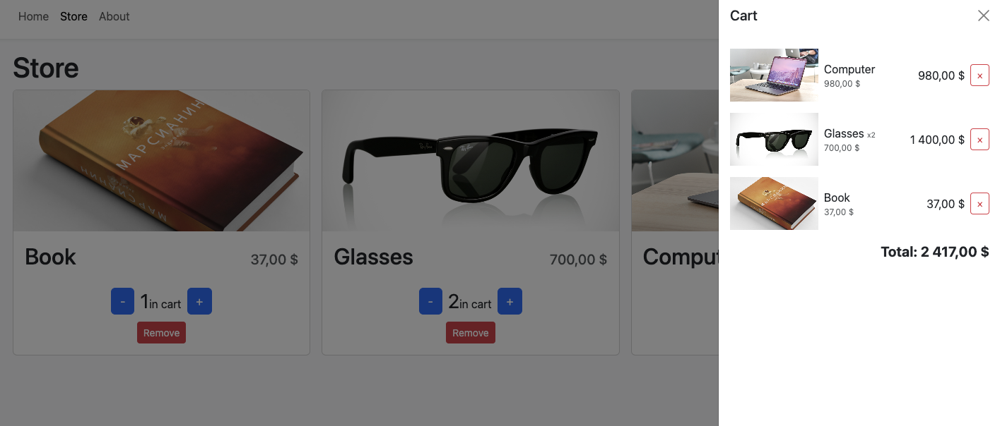

<h1 align="center">me:Store</h1>

  

<b>Ссылки на проект:</b>

Frontend: https://react-typescript-shop-me-store.vercel.app/

<a name="project-description"><h2>1. Описание проекта</h2></a>
Проект "me:Store" - онлайн магазин, создан для практического изучения TypeScript и Vite.

<a name="technologies"><h2>2. Стек технологий</h2></a>

 

<a name="installation"><h2>3. Установка и запуск приложения в локальном репозитории, эксплуатация</h2></a>
1. `git clone https://github.com/Markelov97Vad/react-typescript-shop.git` - клонировать репозиторий на свое устройство (HTTPS)
2. `npm i` - установить зависимости
3. `npm run dev` - запустить приложение

<a name="functionality"><h2>4. Функционал</h2></a>
- Добавление и удаление элементов из карзины
- Адаптивная верстка под все виды устройств

<a name="enhancement"><h2>5. Планы по улучшению</h2></a>
- Получение товаров магазина со стороннего Api
- Добавить содержания на страницы Home и About
